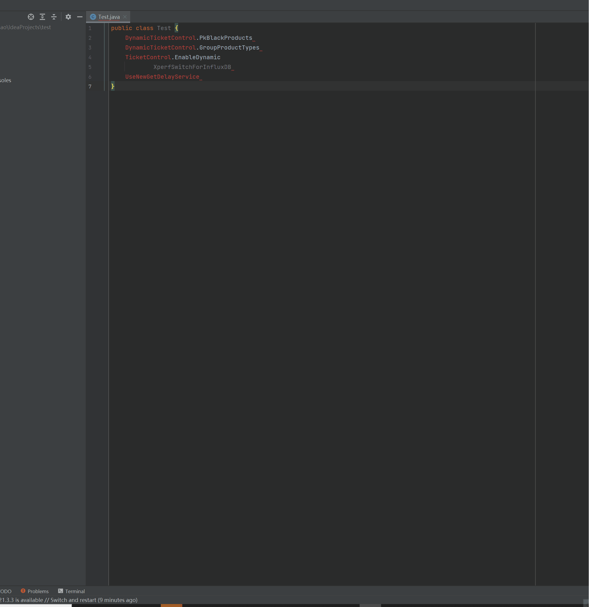
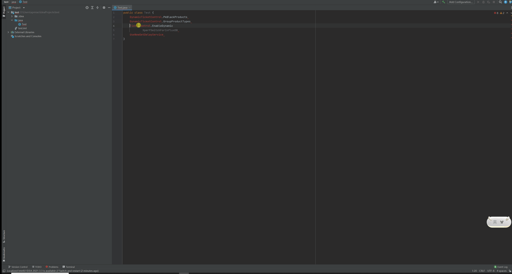

#  
    根据选中的内容快速查询properties的value

## 使用教程
***只支持properties 数据***
 ```json
  {
  "headers":{
    "Accept":"*/*",
    "Accept-Language":"zh-CN,zh;q=0.9",
    "Cache-Control":"no-cache",
    "Content-Type":"application/json",
    "Pragma":"no-cache",
    "X-Requested-With":"XMLHttpRequest",
    "Cookie":"" #用户 cookie 必填
  },
  "body":null,
  "method":"GET",
  "urls":{ # 多个请求配置的数据
    "001-application":"",
    "002-rocketmq":""
  },
  "parse-body":"xxx.xxx.xxxx" # 全量数据节点
}
 ```
# 查询图片


# 版本
v1.0 :



 v1.1 :
  - 更换页面ui展示组件
  - 添加可配置长数据的宽度
  - 提供空噢诶之数据提示信息


